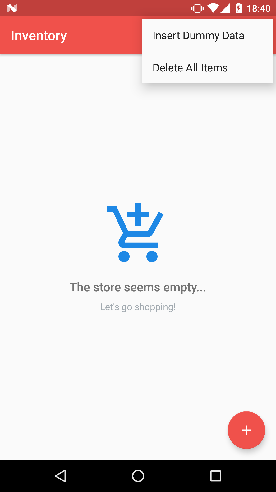
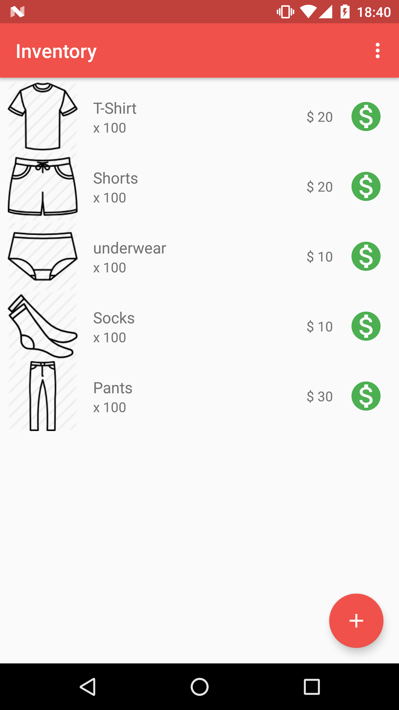
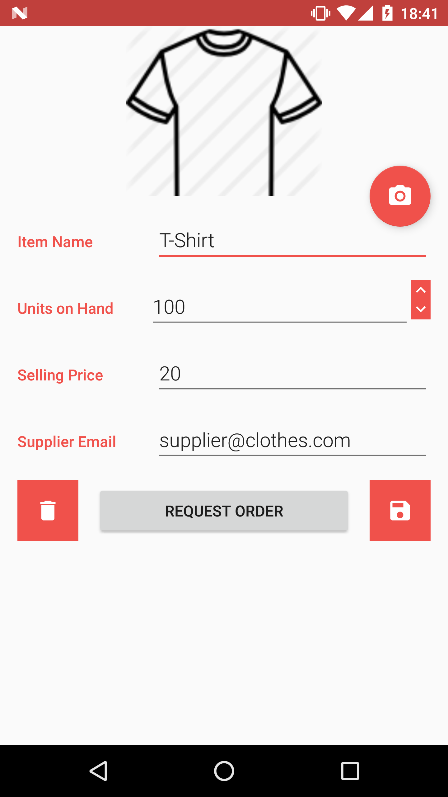

# Android Inventory Manager

- Project **Inventory App** of Android Basics Nanodegree
- [Android Basics Nanodegree at Udacity.com](https://www.udacity.com/course/android-basics-nanodegree-by-google--nd803)

## Android Items

- SQLite with OpenDbHelper
- Cursors
- CursorAdapter
- ListView
- CRUD: Create, Read, Update and Delete database items
- Android permissions

# Description
- Keep track of your inventory
- Sell items with one click
- Edit items
- Show pictures from the items
- Order more items with e-mail or phone contact
- Delete one or all of your items
- Includes a demo content (tap the cloud download icon in the action bar)

# Screenshots
  